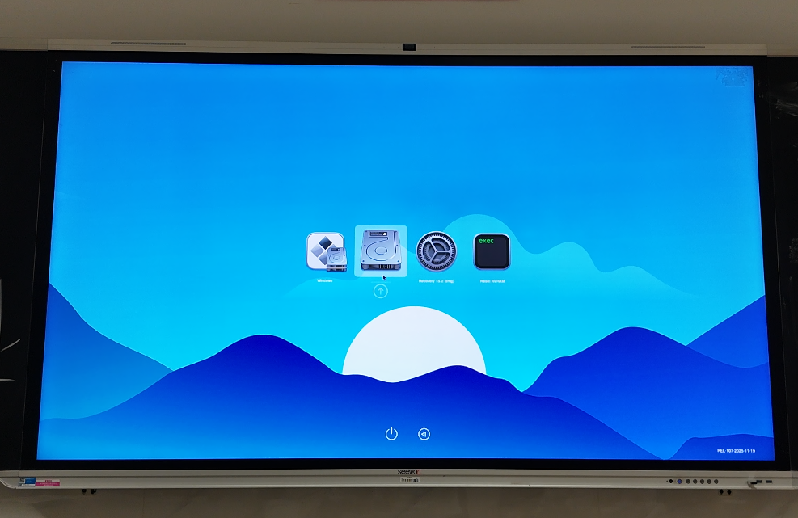
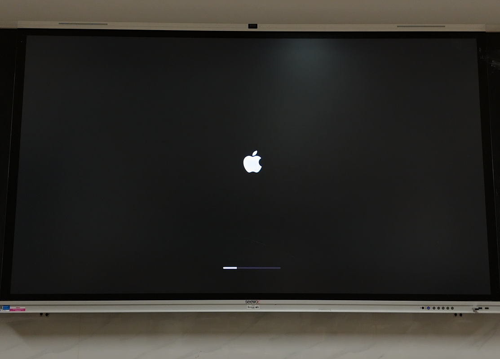
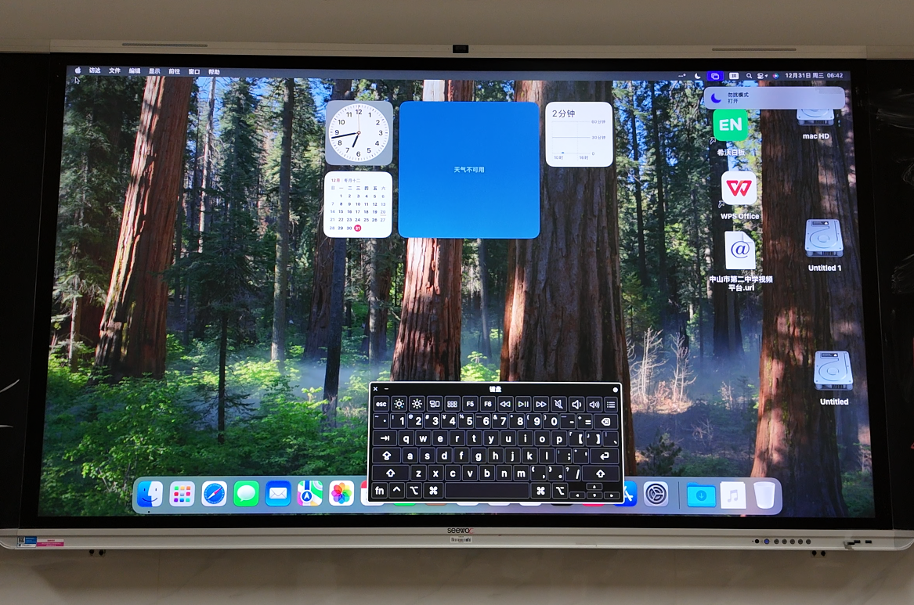
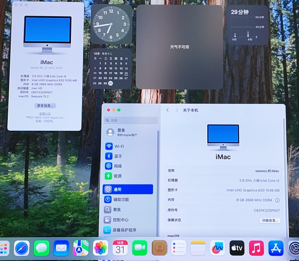

# seewo-MT61A-OpenCore

## 适配的硬件
1. CPU: Intel Core i5-10400
2. GPU: Intel UHD Graphics 630
3. RAM: 8G
4. SSD: 256G
5. 声卡:USB audio(无法驱动)
6. 网卡:Intel i219-V
7. 摄像头:Smart camera

## 使用情况
可以正常上网，触摸，显示，但是无法播放声音,摄像头可以正常调用

## 效果展示
### OC引导界面

### macOS加载界面

### 系统桌面

### 设备信息

